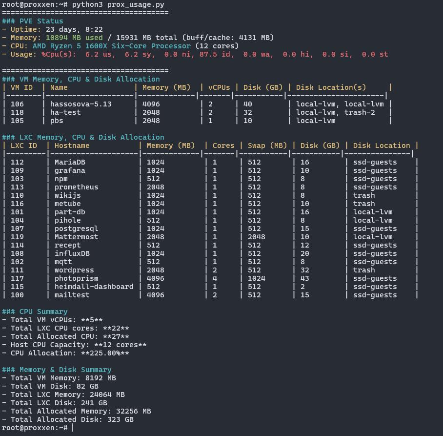

# smart-tools
collection of some script i use to make life easier

# Home Assistant tools:  

# Postgres tools:  
### clean.sh  
A script to clean, vacuum tables and rebuild indexes.  
You need to add username, host and DB before you run it.

# Proxmox tools:  
## prox_usage.py  
run this on your PVE-server:
```sh
python3 prox_usage.py
```



## update_autostart.sh  
A script used to update the --onboot option for guests
To enable autostart, run:  
__./update_autostart.sh 1__  
This will list all guest, both VM & LXC.  
You can select individual guests by type their number, divided by space  
or you can just typ "ALL" to set --onboot 1 for all guests.

__./update_autostart.sh 0__  
Same as above, but this will disable autostart.  

__./update_autostart.sh -l__  
This return a list of all guests and if they are autostart or not.  

